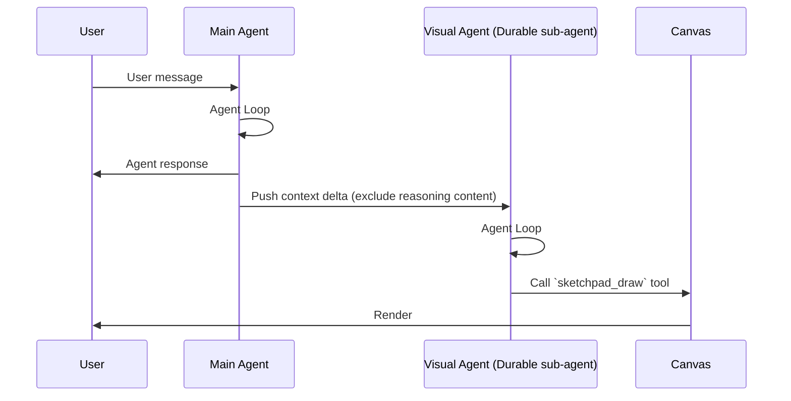
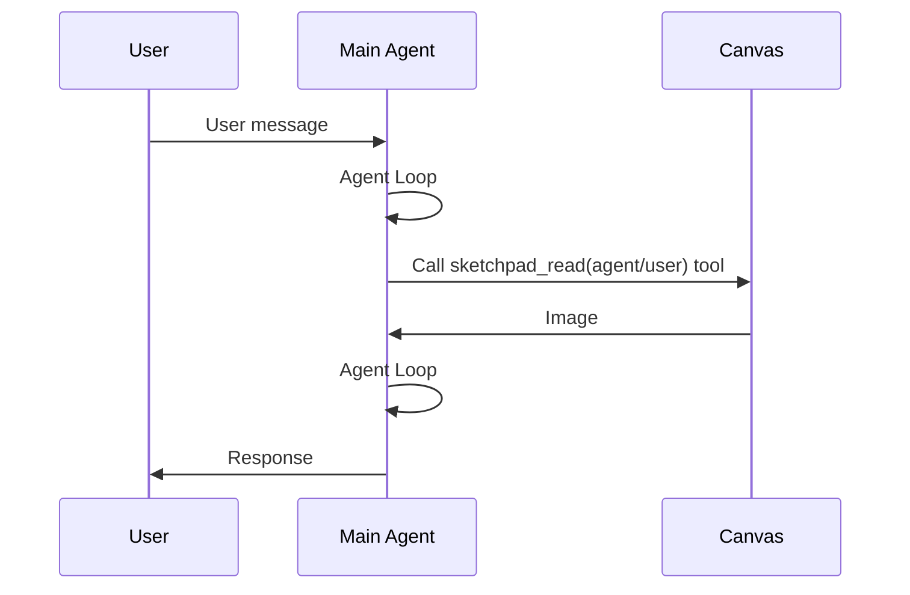

# Design

## Auto Visualize

Idea: Durable Sub Agent

```mermaid
sequenceDiagram
    participant U as User
    participant A as Main Agent
    participant V as Visual Agent (Durable sub-agent)
    participant C as Canvas

    U->>A: User message
    A->>A: Agent Loop
    A->>U: Agent response
    A->>V: Push context delta (exclude reasoning content)
    V->>V: Agent Loop
    V->>C: Call `sketchpad_draw` tool
    C->>U: Render
```

## Agent Read Canvas

```mermaid
sequenceDiagram
    participant U as User
    participant A as Main Agent
    participant C as Canvas

    U->>A: User message
    A->>A: Agent Loop
    A->>C: Call sketchpad_read(agent/user) tool
    C->>A: Image
    A->>A: Agent Loop
    A->>U: Response
```